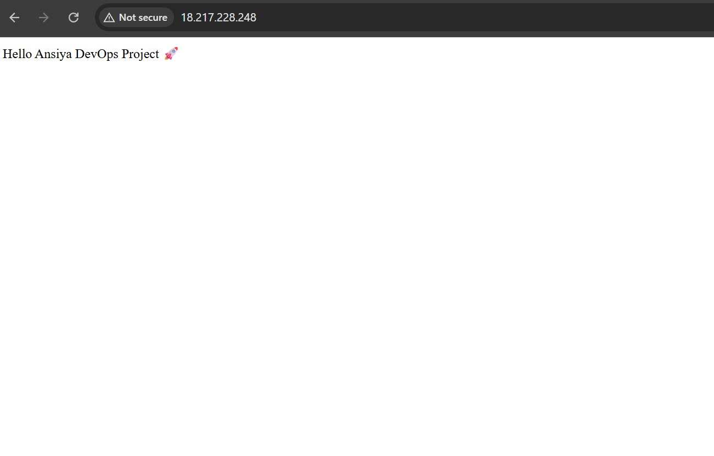
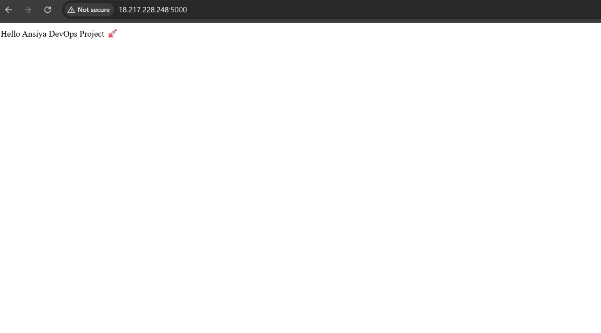
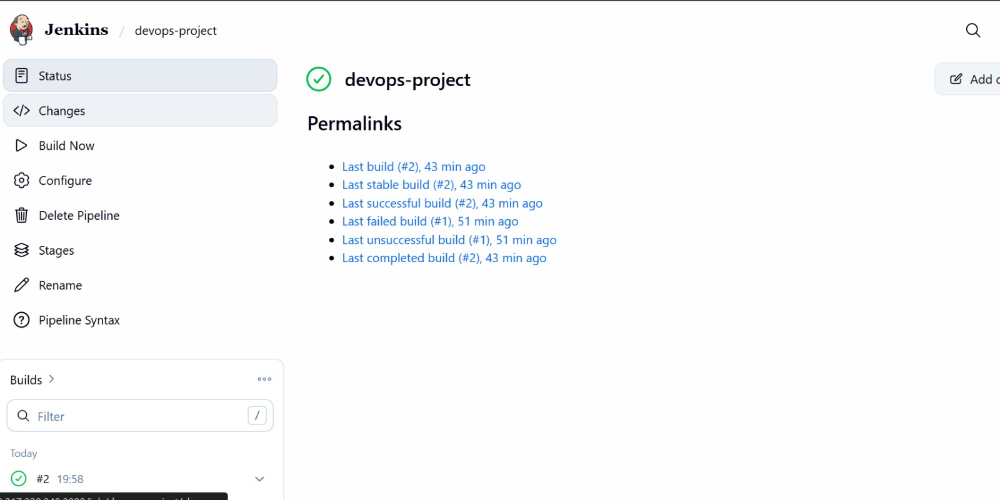

# 🚀 CI/CD Pipeline using Jenkins, Docker, Nginx and AWS EC2

## 📌 Project Overview

This project demonstrates a complete **CI/CD pipeline** for deploying a Python Flask application using **Jenkins, Docker, Nginx, and AWS EC2**.

The pipeline automates the process of:
- Pulling code from GitHub
- Building a Docker image
- Running the application inside a Docker container
- Exposing the application through Nginx reverse proxy

This simulates a **real-world DevOps deployment workflow**.

---

## 🛠 Technologies Used

- AWS EC2
- Jenkins
- Docker
- Nginx
- GitHub
- Python Flask

---

## 🏗 Architecture

Developer → GitHub → Jenkins → Docker → Nginx → User

### Workflow

1. Developer pushes code to GitHub
2. Jenkins pulls the latest code
3. Jenkins builds Docker image
4. Docker container runs the Flask application
5. Nginx forwards requests from port **80 → 5000**
6. Users access the application through **EC2 Public IP**

---

## 📂 Project Structure

```
devops-project
│
├── app.py
├── Dockerfile
├── Jenkinsfile
├── docker-compose.yml
├── requirements.txt
└── README.md
```

---

## ⚙ Jenkins Pipeline

The Jenkins pipeline performs the following steps:

1️⃣ Clone repository from GitHub  
2️⃣ Build Docker image  
3️⃣ Run Docker container  

Example commands executed in pipeline:

```
docker build -t flask-app .
docker run -d -p 5000:5000 flask-app
```

---

## 🐳 Docker

Docker is used to containerize the Flask application so it can run consistently across environments.

Docker builds an image using the **Dockerfile** and runs the container exposing port **5000**.

---

## 🌐 Nginx Reverse Proxy

Nginx is used as a **reverse proxy**.

It forwards traffic from:

```
http://EC2-IP
```

to

```
http://localhost:5000
```

This allows users to access the application without specifying the port number.

---

# 🚀 Application Output

Once deployed, the application can be accessed through:

```
http://EC2-PUBLIC-IP
```

Example output:

```
Hello Ansiya DevOps Project 🚀
```

---

# 📸 Screenshots

### Application running through Nginx (Port 80)



---

### Application running directly from Docker Container (Port 5000)



---

### Jenkins Pipeline Success



---

# 📚 Key Learnings

Through this project I learned:

- Building CI/CD pipelines using Jenkins
- Containerizing applications with Docker
- Configuring Nginx as a reverse proxy
- Deploying applications on AWS EC2
- Automating build and deployment workflows

---

# 👩‍💻 Author

**Ansiya Fassil**

BTech Computer Science and Engineering  
DevOps Enthusiast

GitHub:  
https://github.com/Ansiyafassil
